# WordPress on Docker Swarm with AWS EFS 🐳☁️

A multi-node WordPress deployment running on Docker Swarm across three AWS EC2 instances, using MySQL, Docker Secrets, overlay networking, Swarm's routing mesh, and Amazon EFS for shared persistent WordPress media storage.

This project started as a hands-on Docker Swarm exercise and quickly turned into a lesson in container orchestration, persistent storage, service discovery, failure recovery, AWS networking, and why stateful workloads require a little more planning.

And yes, a monkey was involved. 🐒

---

## 📌 Project Overview

The goal was to deploy WordPress across a three-node Docker Swarm and explore how a multi-service application behaves when containers and nodes fail.

The final environment includes:

- Three Ubuntu EC2 instances
- One Docker Swarm manager
- Two Docker Swarm workers
- Three WordPress replicas
- One MySQL service
- Docker Secrets for database credentials
- Separate frontend and backend overlay networks
- Swarm ingress routing mesh
- Amazon EFS shared storage for WordPress uploads
- Persistent local Docker storage for MySQL
- Placement constraints for the database
- Resource reservations and limits
- Docker Stack deployment using `stack.yml`

The environment was first built manually so I could understand how the individual components connected.

After testing and troubleshooting the working environment, I converted the deployment into a Docker Stack configuration and used the YAML file to reconstruct the application.

---

## 🏗️ Architecture

```text
                         Internet
                            |
                       TCP Port 80
                            |
                 Docker Swarm Routing Mesh
                            |
          +-----------------+-----------------+
          |                 |                 |
     WordPress 1       WordPress 2       WordPress 3
     Swarm Manager      Worker 1          Worker 2
          |                 |                 |
          +---------- frontend-net -----------+
          |
          +---------- backend-net ------------+
                            |
                          MySQL
                            |
                     Worker 1 Only
                            |
                       mysql-data
                     Docker Volume


          WordPress Shared Media Storage
                       |
                  Amazon EFS
                       |
             wordpress-uploads
                /      |      \
               /       |       \
          Manager   Worker 1   Worker 2
               \       |       /
                \      |      /
             WordPress Replicas
```

---

## 🐳 Building the Docker Swarm

The cluster consists of three EC2 instances:

```text
swarm-manager
swarm-worker-1
swarm-worker-2
```

The manager controls the Swarm and schedules services across the available nodes.

WordPress runs with three replicas, allowing Swarm to distribute the application across the cluster.

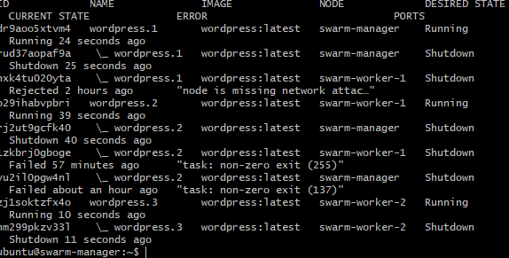

Swarm maintains a desired state. If a WordPress task disappears, Swarm creates another task to replace it.

That behavior became very useful during failure testing later in the project.

---

## 🌐 Overlay Networking

Two Docker overlay networks separate application traffic.

### `frontend-net`

Used by the WordPress service for frontend application networking.

### `backend-net`

Used for communication between WordPress and MySQL.

WordPress joins both networks:

```text
WordPress
   |
   +---- frontend-net
   |
   +---- backend-net ---- MySQL
```

MySQL joins only `backend-net`.

The database does not publish port `3306` externally.

---

## 🔎 Docker Service Discovery

WordPress connects to the database using:

```text
mysql:3306
```

instead of a hardcoded container or EC2 IP address.

Docker Swarm's internal service discovery resolves the `mysql` service name for the WordPress containers.

This allows WordPress to reference the service logically rather than depending on a particular container IP.

---

## 🚦 Swarm Routing Mesh

WordPress publishes:

```text
TCP 80 → Container TCP 80
```

using Swarm ingress mode.

This allows HTTP traffic arriving at a Swarm node to be routed to an available WordPress task.

During testing, the WordPress site was successfully accessed through multiple EC2 node public IP addresses.

---

## 🔐 Docker Secrets

Database credentials are stored using Docker Secrets instead of being placed directly inside `stack.yml`.

The deployment uses:

```text
mysql_root_password
wordpress_db_password
```

The secrets are mounted inside the containers under:

```text
/run/secrets/
```

MySQL reads the credentials using environment variables that point to the secret files:

```yaml
MYSQL_ROOT_PASSWORD_FILE: /run/secrets/mysql_root_password
MYSQL_PASSWORD_FILE: /run/secrets/wordpress_db_password
```

WordPress uses:

```yaml
WORDPRESS_DB_PASSWORD_FILE: /run/secrets/wordpress_db_password
```

The actual password values are **not stored in this repository**.

---

# 🗄️ MySQL Persistent Storage

MySQL stores its database files in a Docker volume mounted at:

```text
/var/lib/mysql
```

The volume is named:

```text
mysql-data
```

Because this is node-local storage, the MySQL service is constrained to a node carrying the label:

```text
database=true
```

For this lab, that node is:

```text
swarm-worker-1
```

The placement rule in `stack.yml` is:

```yaml
placement:
  constraints:
    - node.labels.database == true
```

This keeps MySQL on the node containing its existing database volume.

---

## ⚠️ Stateful Workload Lesson

This design also introduced an important limitation.

If Worker 1 becomes unavailable:

```text
Worker 1 Down
      |
      v
MySQL unavailable
      |
      v
mysql-data remains on Worker 1
```

Swarm cannot simply move MySQL to another node because the database files exist on Worker 1's local Docker volume.

During testing, Worker 1 became unreachable multiple times. WordPress tasks could recover elsewhere, but MySQL could not relocate because of its stateful storage dependency.

This demonstrated an important difference between orchestrating application containers and orchestrating stateful database workloads.

For a more production-oriented AWS architecture, I would likely move the database outside the Swarm cluster and use a managed database service such as Amazon RDS.

---

# 📁 The WordPress Storage Problem

The most interesting problem in this project appeared after scaling WordPress to three replicas.

Initially, every WordPress container stored uploaded media in its own local filesystem:

```text
/var/www/html/wp-content/uploads
```

That meant:

```text
WordPress 1 uploads image
        |
        v
Local container filesystem

WordPress 2 → does not have the file
WordPress 3 → does not have the file
```

An image could appear when one replica handled the request but disappear when another replica served the page.

Even worse, when the container containing the uploaded file was replaced, the file disappeared completely.

The database still knew that the media existed, but the actual file was gone.

The first test monkey did not survive this discovery. 🐒💀

The missing uploads were verified across the active WordPress containers:

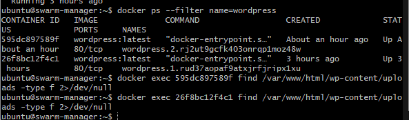

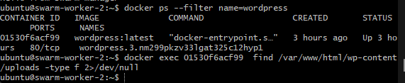

This demonstrated why container-local storage was not appropriate for media shared by multiple WordPress replicas.

---

# ☁️ Adding Amazon EFS

To solve the shared-storage problem, I added Amazon Elastic File System.

EFS provides a shared NFS filesystem that can be mounted by multiple EC2 instances.

The filesystem is mounted on every Swarm node at:

```text
/mnt/efs
```

The shared WordPress upload directory is:

```text
/mnt/efs/wordpress-uploads
```

The EFS mount was first validated directly from the Swarm manager.

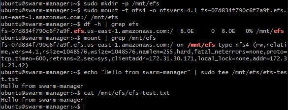

A test file created from one node was then successfully read from another node.

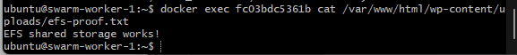

This proved that the EC2 instances were accessing the same filesystem rather than independent local directories.

---

## 🔒 Securing EFS

A dedicated security group was created for EFS.

NFS traffic uses:

```text
TCP 2049
```

Instead of allowing public access, the EFS security group permits NFS connections from the security group associated with the Swarm EC2 instances.

Conceptually:

```text
Swarm EC2 Security Group
          |
          | TCP 2049
          v
   EFS Security Group
          |
          v
      Amazon EFS
```

The filesystem is not exposed to the public internet.

---

## 🔄 Making the EFS Mount Persistent

Because EFS was initially mounted manually, a reboot would remove the mount.

Each Swarm node was therefore configured to mount the EFS filesystem through `/etc/fstab`.

This ensures the shared filesystem is available again after an EC2 reboot.

The Docker Stack depends on this host-level prerequisite because the WordPress service uses a bind mount from the host filesystem.

---

# 🐳 Connecting WordPress to EFS

Each WordPress replica bind-mounts:

```text
Host:
/mnt/efs/wordpress-uploads
```

to:

```text
Container:
/var/www/html/wp-content/uploads
```

The `stack.yml` configuration is:

```yaml
volumes:
  - type: bind
    source: /mnt/efs/wordpress-uploads
    target: /var/www/html/wp-content/uploads
```

The resulting storage path is:

```text
                    Amazon EFS
                         |
             /wordpress-uploads
                         |
           +-------------+-------------+
           |             |             |
        Manager       Worker 1      Worker 2
           |             |             |
       WordPress      WordPress      WordPress
           |             |             |
           +------ wp-content/uploads -+
```

The EFS-backed mount was verified from inside the running WordPress containers.

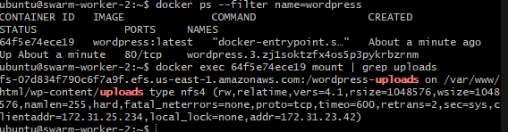

---

# 🐒 Testing Shared WordPress Media

After EFS was connected to the WordPress replicas, a second test image was uploaded.

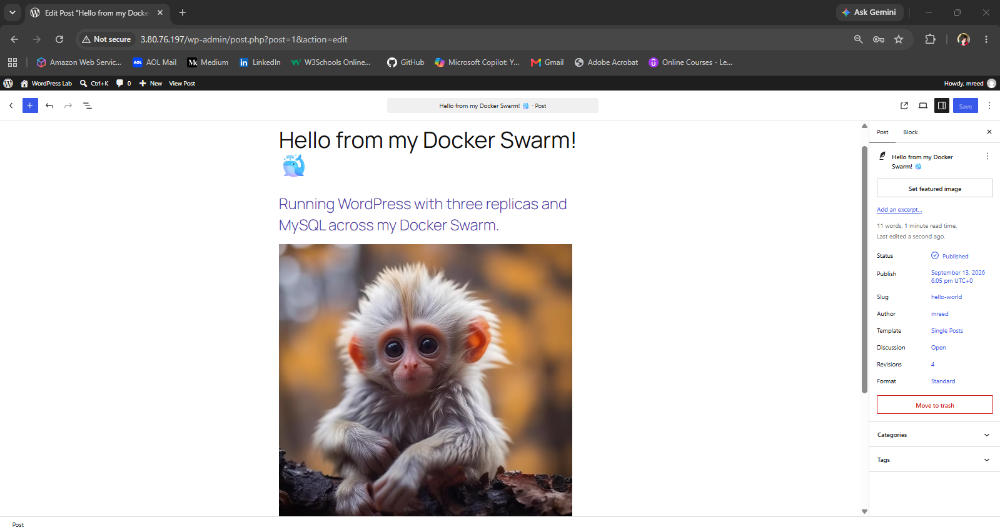

The image successfully displayed when the site was accessed through another Swarm node.

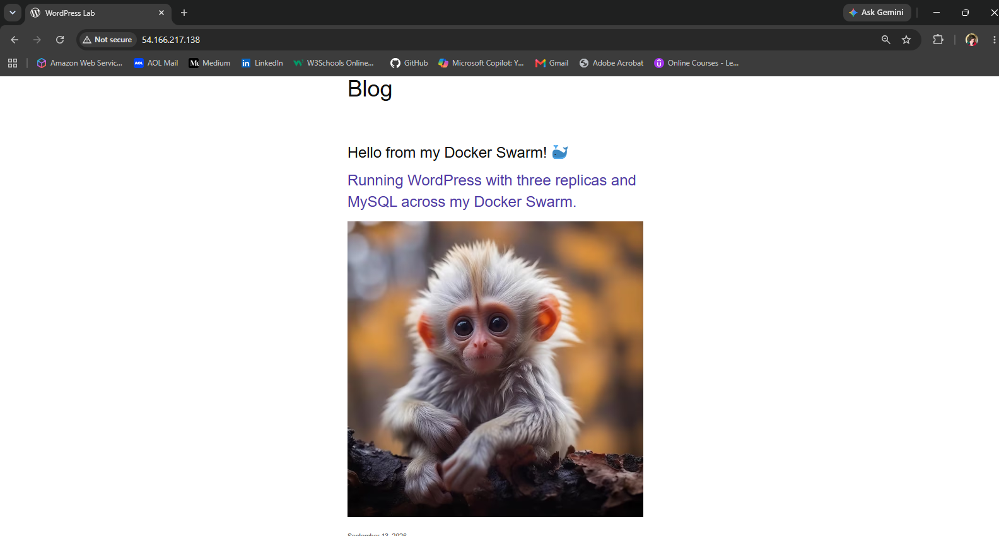

The uploaded image and WordPress-generated thumbnail files were also visible directly through the shared EFS filesystem.

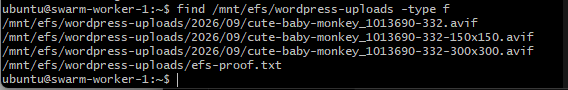

At this point, every WordPress replica could access the same media files.

---

# 💥 Failure Testing and Self-Healing

Getting the application working was not enough.

I wanted to verify what happened when something actually failed.

A running WordPress container was intentionally killed.

Docker Swarm detected that the service no longer had its desired number of replicas and created a replacement task.

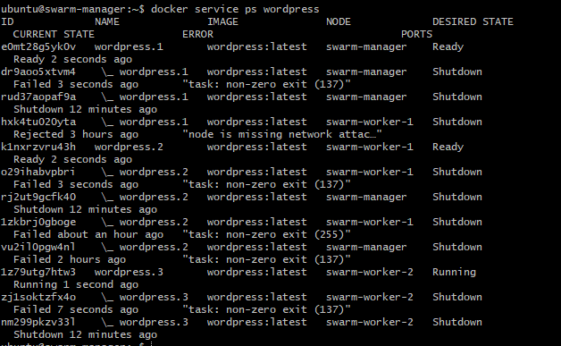

Because WordPress uploads were now stored on EFS rather than inside the destroyed container, the replacement container immediately had access to the same media.

```text
Container killed
      |
      v
Swarm detects missing replica
      |
      v
Replacement container created
      |
      v
EFS bind mount attached
      |
      v
Existing media still available
```

Monkey #2 survived. 🐒✅

---

# 📦 Converting the Deployment to Docker Stack

After manually building and validating the environment, I converted the configuration into:

```text
stack.yml
```

The stack defines:

- MySQL
- WordPress
- Three WordPress replicas
- Docker Secrets
- Frontend and backend overlay networks
- MySQL persistent storage
- MySQL placement constraints
- EFS-backed WordPress uploads
- Published HTTP port
- Restart policies
- Memory reservations
- Memory limits

The YAML was validated before deployment using Docker's configuration parsing tools.

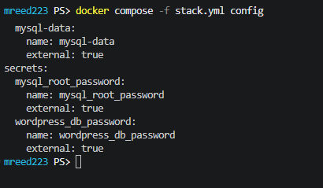

---

# 🚀 Rebuilding the Application from YAML

The final test was to determine whether `stack.yml` could actually reconstruct the working environment.

The manually created WordPress and MySQL services were removed.

The following resources were intentionally preserved:

```text
mysql-data Docker volume
Docker Secrets
Overlay networks
Amazon EFS filesystem
EFS mounts
```

The application was then deployed using:

```bash
docker stack deploy -c stack.yml wordpress
```

Docker Swarm successfully created:

```text
wordpress_mysql       1/1
wordpress_wordpress   3/3
```

The WordPress replicas were distributed across all three Swarm nodes.

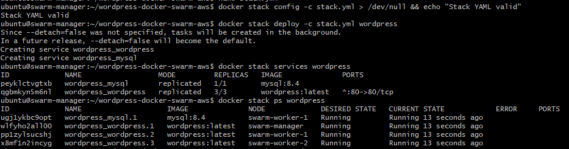

This demonstrated that the YAML represented the environment rather than merely documenting it.

---

# 🐒 Final Persistence Test

After the manually created services were removed and the application was reconstructed from `stack.yml`, I opened WordPress again.

The original post was still present.

That confirmed MySQL successfully reused the existing `mysql-data` volume.

The uploaded image was also still present.

That confirmed the newly created WordPress containers successfully reconnected to the EFS-backed uploads directory.

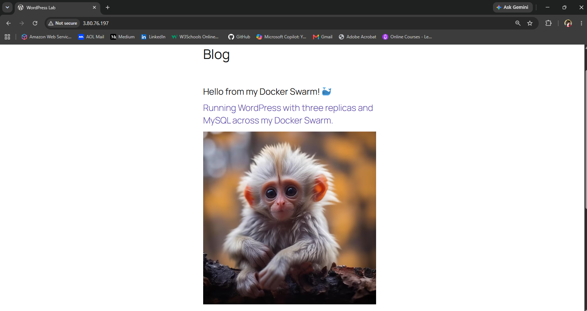

So the final result was:

```text
Manual services removed
        |
        v
Docker Stack deployed
        |
        +---- MySQL reconnects to mysql-data
        |
        +---- WordPress reconnects to EFS
        |
        +---- Three replicas recreated
        |
        v
Application data survives
        |
        v
🐒 Still here
```

---

# 🧯 Troubleshooting Highlights

This project included several real troubleshooting scenarios rather than a straight-line deployment.

### Swarm Communication Failure

Swarm networking initially experienced communication problems because TCP/UDP port `7946` had accidentally been configured as `7947` in the AWS security group.

Correcting the security group rule restored Swarm gossip and overlay-network communication.

### WordPress Media Disappearing

Uploaded media initially existed only inside individual WordPress container filesystems.

Scaling and container replacement exposed the problem.

Amazon EFS was implemented as shared persistent storage.

### Worker 1 Instability

The database worker became unreachable multiple times during testing.

The EC2 instance was running with very limited memory headroom and no swap, although testing did not produce definitive evidence of an out-of-memory kill.

This reinforced the need to distinguish observed symptoms from a confirmed root cause.

It also demonstrated the availability limitation created by keeping MySQL and its local volume on one worker.

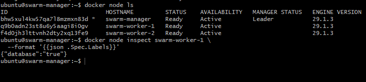

### Docker Stack Image Digest Error

While converting the deployment to Docker Stack, an incorrectly copied image digest caused:

```text
invalid image reference for service mysql:
invalid checksum digest length
```

The stack deployment was stopped, the image references were corrected, the YAML was revalidated, and the deployment was attempted again successfully.

---

# 🧠 Resource Management

The small EC2 instances used in this lab have limited memory.

During troubleshooting, the MySQL container consumed a significant portion of Worker 1's available RAM.

The final stack therefore includes memory reservations and limits.

For MySQL:

```yaml
resources:
  reservations:
    memory: 256M
  limits:
    memory: 600M
```

For WordPress:

```yaml
resources:
  reservations:
    memory: 64M
  limits:
    memory: 256M
```

A reservation helps Swarm account for expected resource usage during scheduling.

A limit establishes the maximum amount of memory the container is allowed to consume.

These controls do not replace appropriate infrastructure sizing, but they provide better workload boundaries.

---

# 🔒 AWS Security Group Configuration

The Swarm cluster requires several ports for communication.

| Port | Protocol | Purpose |
|---|---|---|
| 22 | TCP | SSH administration |
| 80 | TCP | WordPress HTTP traffic |
| 2377 | TCP | Swarm management |
| 7946 | TCP/UDP | Swarm node communication |
| 4789 | UDP | Overlay network traffic |
| 2049 | TCP | EFS / NFS |

Swarm-specific ports are restricted between cluster nodes where appropriate.

NFS access to EFS is restricted using security-group-to-security-group access.

MySQL port `3306` is not published publicly.

---

# 📂 Repository Structure

```text
wordpress-docker-swarm-aws/
│
├── stack.yml
├── README.md
├── .gitignore
│
└── screenshots/
    ├── 01-efs-mounted-manager.png
    ├── 02-wordpress-efs-mount-worker2.png
    ├── 03-cross-node-efs-proof-worker1.png
    ├── 04-wordpress-monkey-upload-admin.png
    ├── 05-wordpress-monkey-served-other-node.png
    ├── 06-efs-shared-upload-files.png
    ├── 07-swarm-self-healing-after-kill.png
    ├── 08-wordpress-replicas-across-three-nodes.png
    ├── 09-before-efs-manager-no-uploads.png
    ├── 10-before-efs-worker2-no-uploads.png
    ├── 11-before-efs-worker1-no-wordpress.png
    ├── 12-stack-yaml-validation.png
    ├── 13-stack-deployment-success.png
    ├── 14-monkey-survives-stack-redeployment.png
    └── 15-worker1-recovered-database-label.png
```

---

# 🛠️ Technologies Used

### AWS

- Amazon EC2
- Amazon EFS
- AWS Security Groups

### Containers & Orchestration

- Docker
- Docker Swarm
- Docker Stack
- Docker Secrets
- Docker Volumes
- Overlay Networks
- Swarm Routing Mesh
- Service Discovery

### Application

- WordPress
- MySQL 8.4
- Apache

### Linux & Infrastructure

- Ubuntu
- NFSv4.1
- Linux filesystem mounts
- `/etc/fstab`
- Git
- GitHub

---

# 🧪 Skills Practiced

This project provided hands-on practice with:

- Multi-node container orchestration
- Docker Swarm services
- Docker Stack YAML
- Desired-state management
- Container self-healing
- Service discovery
- Overlay networking
- Routing mesh behavior
- Docker Secrets
- Persistent container storage
- Shared network storage
- Amazon EFS
- NFS
- AWS security groups
- Stateful vs. stateless workloads
- Placement constraints
- Resource reservations and limits
- Linux troubleshooting
- Docker troubleshooting
- Failure testing
- Cloud architecture
- Technical documentation

---

# ⚠️ Lab vs. Production

This project is a learning environment rather than a production WordPress architecture.

A production implementation would require additional considerations, including:

- Amazon RDS or another highly available database architecture
- HTTPS/TLS
- DNS
- A production load-balancing strategy
- Automated EC2 and EFS provisioning
- Automated EFS mounting
- Health checks
- Centralized monitoring and alerting
- Database backup and restore automation
- More appropriately sized compute instances
- Infrastructure as Code for AWS resources
- Stronger host-level security controls
- Controlled application image versioning
- Patch and upgrade strategies

The MySQL service in this lab intentionally remains tied to one worker and a local Docker volume. This was useful for learning, but it represents a single-node dependency that I would redesign for a production workload.

---

# 💡 Key Takeaways

The biggest lesson from this project was that **container orchestration does not automatically solve application state**.

Docker Swarm can replace a failed WordPress container, but that replacement is only useful if the data the application needs exists somewhere outside the destroyed container.

That became clear when the first uploaded image disappeared.

Adding Amazon EFS changed the architecture from:

```text
Container = application + unique local media
```

to:

```text
Container = replaceable application instance
EFS       = shared persistent media
MySQL     = persistent application data
```

The project also reinforced that different types of state require different storage strategies.

EFS made sense for shared WordPress media.

The MySQL database has different availability and storage requirements, which is why a future production design would likely move it to a managed database service instead of simply placing its database files on the same shared filesystem.

Most importantly, every major change was tested rather than assumed:

**Build → Break → Observe → Troubleshoot → Improve → Rebuild → Validate**

And Monkey #2 lived to tell the story. 🐒💚